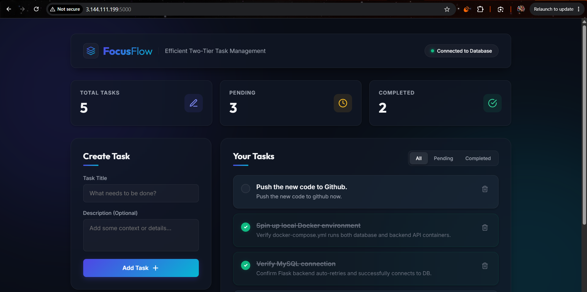
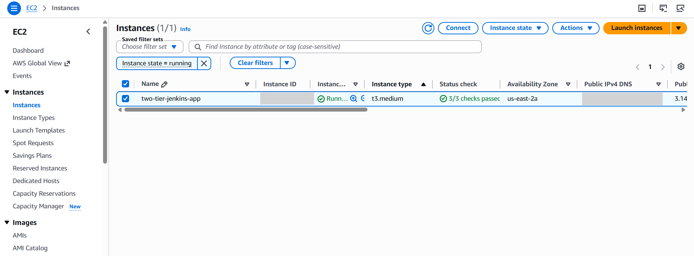
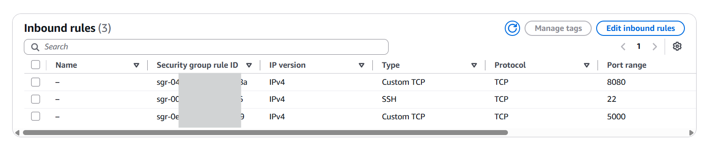
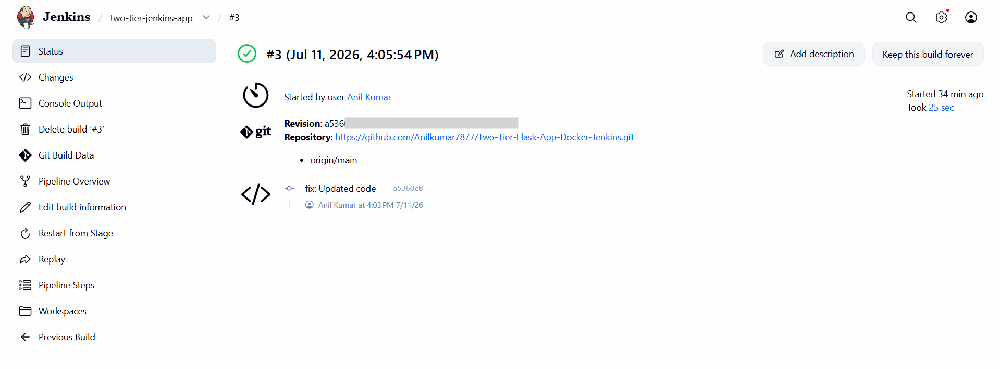

# FocusFlow // Two-Tier Flask-MySQL CI/CD Project


A containerized, two-tier task management application (SPA) with a Flask REST API backend, a MySQL database, and a responsive glassmorphic frontend. This project is configured for automated deployment using a Jenkins CI/CD pipeline.



---

## 📸 Infrastructure & Application Showcase

### 1. AWS EC2 Host Instance

*Figure 1: AWS EC2 Ubuntu instance hosting the Jenkins automation server and Docker environment*

### 2. Inbound Security Rules

*Figure 2: AWS Security Group inbound traffic rules configured for SSH, Jenkins (8080), and Web App (5000)*

### 3. FocusFlow Dashboard UI

*Figure 3: Fully responsive task dashboard running on port 5000*

### 4. Successful CI/CD Pipeline Execution

*Figure 4: Automated checkout, image builds, deployment, and health checks completed in Jenkins*

---

## 🔄 CI/CD Pipeline with Jenkins

This project features a declarative [Jenkinsfile](two-tier-flask-app-docker-jenkins/Jenkinsfile) that automates the code checkout, builds the Docker images, orchestrates containers, and runs integration health checks.

### 🔌 Automated Build Trigger via GitHub Webhook

To configure Jenkins to automatically build and deploy whenever code is pushed to your GitHub repository:

#### Step 1: Configure Webhook in GitHub
1. Open your repository on GitHub.
2. Navigate to **Settings** > **Webhooks** > **Add webhook**.
3. Set the **Payload URL** to:
   ```
   http://<YOUR_EC2_PUBLIC_IP>:8080/github-webhook/
   ```
   *(Note: The trailing slash `/` is mandatory).*
4. Set the **Content type** to `application/json`.
5. Keep the event trigger as **Just the push event**.
6. Click **Add webhook**. GitHub will send a test ping to verify connection.

#### Step 2: Configure Build Trigger in Jenkins
1. Open the Jenkins dashboard and select your project pipeline.
2. Click **Configure** on the left menu.
3. Scroll down to the **Build Triggers** section.
4. Check the box for **GitHub hook trigger for GITScm polling**.
5. Save the configuration.

Whenever a developer runs `git push`, GitHub will send a webhook payload, and Jenkins will immediately trigger a clean SCM pull, build your Docker images, and deploy the application.

---

### ⏰ Fallback: Polling SCM (Alternative Trigger)

If your Jenkins instance is behind a firewall or running locally (without a public IP address to receive GitHub Webhooks), you can set up periodic SCM polling:

1. In the Jenkins Job Configuration, scroll to the **Build Triggers** section.
2. Check the box for **Poll SCM**.
3. Enter a cron expression in the **Schedule** text box. For example:
   * `H/5 * * * *` (Poll GitHub for changes every 5 minutes)
   * `* * * * *` (Poll GitHub every minute)
4. Save the configuration.

---

## ⚙️ Ports and Network Layout

Once deployed by Jenkins, the services are bound on the EC2 host:

| Service | Address | Container Port | Purpose |
| :--- | :--- | :--- | :--- |
| **Frontend & API** | `http://<EC2_IP>:5000` | `5000` | User dashboard interface and task endpoints |
| **MySQL Database** | `localhost:3307` | `3306` | Secure local MySQL access (Port 3307 prevents system conflicts) |
| **Jenkins Server** | `http://<EC2_IP>:8080` | `8080` | Jenkins automation portal |

---

## 📂 Project Architecture

```
├── backend/
│   ├── app.py                # Flask REST API server and static host
│   ├── requirements.txt      # Python dependencies (Flask, mysql-connector, CORS)
│   └── Dockerfile            # Container build specification
├── db/
│   └── init.sql              # Database setup and seed tasks
├── frontend/
│   ├── index.html            # Core SPA dashboard layout
│   ├── styles.css            # Custom CSS styles (glassmorphism, dark theme)
│   └── app.js                # Vanilla JS client logic (fetch API)
├── public/
│   ├── image.png             # AWS EC2 host instance screenshot
│   ├── image-1.png           # Inbound Security Rules screenshot
│   ├── image-2.png           # Successful build screenshot
│   └── image-3.png           # FocusFlow Dashboard UI screenshot
├── docker-compose.yml        # Orchestration configuration
├── Jenkinsfile               # Declarative CI/CD pipeline
└── README.md                 # Project guide
```
